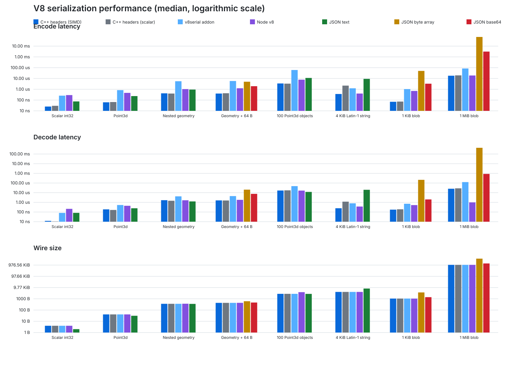

# Performance

Generated 2026-09-01T21:11:53.292Z on Apple M4 Max (arm64), Node v22.20.0, V8 12.4.254.21-node.33.

## Methodology

- Seven timed rounds per operation; tables report the median nanoseconds per operation.
- Every operation is warmed up first and its result is consumed.
- Encode and decode are measured separately; round trip is the sum of their medians.
- The writer-reuse comparison measures only C++ encoding: the one-shot path constructs a capacity-reserved `Writer`, moves its vector out with `take()`, and destroys that vector per message; the reuse path keeps one `Writer` and calls `reset()`. Both paths consume representative output bytes to prevent compiler elision, but neither copies the completed payload to a downstream consumer.
- `C++ headers (SIMD)` calls `Writer` and `Reader` directly with native values and enables the architecture-specific string paths.
- `C++ headers (scalar)` builds the same benchmark with `V8SERIAL_DISABLE_SIMD=1` for a like-for-like baseline.
- `v8serial addon` includes generic JavaScript object traversal and N-API boundary cost.
- `Node v8` is Node.js `v8.serialize()` and `v8.deserialize()`.
- `JSON text` applies only to payloads without binary values.
- `JSON byte array` preserves Uint8Array as JSON decimal byte arrays.
- `JSON base64` preserves Uint8Array using base64 text and includes conversion in both timings.
- Results are machine-specific; regenerate with `npm run bench`.
- The C++ reader returns owning strings and byte vectors. Native ArrayBuffer views copy only the selected byte range after validating backing-buffer metadata. Node may reconstruct a host-object typed array as a view into the serialized input, so its large-blob decode has different ownership semantics.
- Bulk boundary cases run in fresh child processes with 5 samples per arm. Peak RSS is the child process high-water mark; CV is the coefficient of variation of native-operation samples.
- String-path microbenchmarks are separate: `build/Release/v8serial_native_bench --strings`. The scalar companion disables both explicit SIMD and compiler loop vectorization.

## Highlights

- JSON text is fastest for scalar and small plain JavaScript values because V8 has highly optimized built-in JSON paths.
- SIMD makes the 4 KiB Latin-1 native round trip 8.6x faster than the scalar path.
- For geometry with a 64-byte blob, direct C++ headers are 5.2x faster than JSON base64. The generic addon bridge is 1.1x the JSON-base64 latency because JavaScript property traversal dominates this small payload.
- For a 1 MiB blob, direct C++ headers are 86.6x faster and the addon bridge is 16.8x faster than JSON base64, while avoiding base64's wire-size expansion.
- Node V8 is exceptionally fast for large typed arrays because its host-object deserializer may return a view into the serialized input; the standalone reader instead returns owning native bytes. After 1.0, that owning path copies the selected view range once; the 1 MiB blob decode numbers below were generated before that change and are conservative.
- On this run, reusing one reserved `Writer` with `reset()` measured 81.7% lower latency for scalar encoding and 11.7% lower for nested geometry versus constructing and destroying a writer for every message.
- The bulk boundary suite separates N-API call amplification, nested object traversal, buffer copying, owning-tree allocation, and streaming scalar consumption instead of attributing all costs to serialization.

## Bulk JavaScript/native boundary

This suite models bulk tabular import across N-API. Every arm consumes the same positional scalar rows and native checksum work. Row construction is outside the timed operation. Serialized totals include `v8.serialize()`; native operation timings do not.

[iTwin/imodel-native#1566](https://github.com/iTwin/imodel-native/pull/1566) motivated the workload: its 1,000,142-row CSV import reached 502,135 end-to-end rows/s through one serialized buffer and 954,372 rows/s through native file streaming, versus 56,812 rows/s through repeated `ECSqlWriteStatement` calls.

### 100,000 rows x 5 columns

| Transfer shape | Native operation | `v8.serialize()` | Serialization-inclusive | Rows/s | Values/s | Peak RSS | CV |
|---|---:|---:|---:|---:|---:|---:|---:|
| Per-cell calls + per-row step | 18.06 ms | — | 18.06 ms | 5,537,446 | 27,687,230 | 78.55 MiB | 1.7% |
| Per-row variadic call + step | 13.19 ms | — | 13.19 ms | 7,580,574 | 37,902,870 | 72.47 MiB | 1.6% |
| One call, validated N-API array traversal | 42.74 ms | — | 42.74 ms | 2,339,481 | 11,697,404 | 71.31 MiB | 1.7% |
| One call, optimized N-API array traversal | 24.95 ms | — | 24.95 ms | 4,008,329 | 20,041,647 | 71.27 MiB | 1.7% |
| One call, N-API object traversal | 60.64 ms | — | 60.64 ms | 1,649,011 | 8,245,057 | 113.19 MiB | 1.6% |
| One buffer, owning value tree | 24.27 ms | 23.17 ms | 47.15 ms | 2,120,852 | 10,604,259 | 176.14 MiB | 1.8% |
| One buffer, copied streaming rows | 5.84 ms | 21.06 ms | 26.90 ms | 3,717,322 | 18,586,610 | 92.11 MiB | 1.2% |
| One buffer, borrowed streaming rows | 5.92 ms | 21.84 ms | 27.76 ms | 3,602,072 | 18,010,359 | 88.83 MiB | 1.6% |
| Native-generated ceiling | 2.89 ms | — | 2.89 ms | 34,592,128 | 172,960,642 | 42.39 MiB | 0.7% |

### 100,000 rows x 12 columns

| Transfer shape | Native operation | `v8.serialize()` | Serialization-inclusive | Rows/s | Values/s | Peak RSS | CV |
|---|---:|---:|---:|---:|---:|---:|---:|
| Per-cell calls + per-row step | 41.67 ms | — | 41.67 ms | 2,399,612 | 28,795,345 | 89.59 MiB | 0.8% |
| Per-row variadic call + step | 31.93 ms | — | 31.93 ms | 3,131,403 | 37,576,833 | 86.09 MiB | 1.9% |
| One call, validated N-API array traversal | 95.32 ms | — | 95.32 ms | 1,049,115 | 12,589,374 | 92.00 MiB | 1.8% |
| One call, optimized N-API array traversal | 56.85 ms | — | 56.85 ms | 1,759,136 | 21,109,626 | 92.02 MiB | 1.4% |
| One call, N-API object traversal | 139.89 ms | — | 139.89 ms | 714,831 | 8,577,974 | 136.42 MiB | 4.8% |
| One buffer, owning value tree | 58.85 ms | 35.13 ms | 94.46 ms | 1,058,662 | 12,703,944 | 295.41 MiB | 3.0% |
| One buffer, copied streaming rows | 12.73 ms | 34.79 ms | 47.65 ms | 2,098,673 | 25,184,071 | 116.56 MiB | 1.9% |
| One buffer, borrowed streaming rows | 13.18 ms | 35.61 ms | 48.79 ms | 2,049,613 | 24,595,359 | 108.13 MiB | 2.3% |
| Native-generated ceiling | 7.21 ms | — | 7.21 ms | 13,862,593 | 166,351,114 | 42.23 MiB | 4.9% |

### 1,000,000 rows x 5 columns

The million-row case excludes object traversal and owning-tree decoding to keep peak memory bounded. Those costs are characterized by the 100,000-row matrix above.

| Transfer shape | Native operation | `v8.serialize()` | Serialization-inclusive | Rows/s | Values/s | Peak RSS | CV |
|---|---:|---:|---:|---:|---:|---:|---:|
| Per-cell calls + per-row step | 184.91 ms | — | 184.91 ms | 5,407,945 | 27,039,725 | 216.98 MiB | 2.3% |
| Per-row variadic call + step | 138.35 ms | — | 138.35 ms | 7,227,925 | 36,139,625 | 217.42 MiB | 2.1% |
| One call, validated N-API array traversal | 434.66 ms | — | 434.66 ms | 2,300,656 | 11,503,279 | 253.28 MiB | 2.0% |
| One call, optimized N-API array traversal | 252.34 ms | — | 252.34 ms | 3,962,867 | 19,814,333 | 251.73 MiB | 1.1% |
| One buffer, copied streaming rows | 60.64 ms | 215.57 ms | 276.43 ms | 3,617,616 | 18,088,081 | 383.75 MiB | 2.0% |
| One buffer, borrowed streaming rows | 59.80 ms | 218.67 ms | 279.99 ms | 3,571,586 | 17,857,931 | 345.25 MiB | 3.1% |
| Native-generated ceiling | 29.27 ms | — | 29.27 ms | 34,161,002 | 170,805,012 | 42.20 MiB | 1.8% |

### Measured conclusions

- Streaming borrowed scalars made native consumption 4.5x faster than constructing an owning value tree and reduced peak RSS from 295.41 MiB to 108.13 MiB.
- Including `v8.serialize()`, streaming rows were 2.0x faster than validated nested-array traversal and 2.9x faster than object traversal.
- Borrowing instead of copying the serialized buffer measured 3.5% higher native latency and reduced peak RSS from 116.56 MiB to 108.13 MiB.
- The synthetic per-row variadic baseline completed in 31.93 ms, versus 48.79 ms including serialization. Serialization becomes compelling when it also removes higher-level wrapper, property lookup, binding, or statement-call costs; the checksum-only benchmark does not model those database costs.

For the million-row case, streaming native decoding took 59.80 ms, while `v8.serialize()` took 218.67 ms and dominated the 279.99 ms serialization-inclusive total.

### Function arity with a fixed scalar count

Each row width processes approximately the same total number of scalar values. The per-cell arm performs one N-API call per value plus one step call per row; the per-row arm performs one variadic N-API call plus one step call per row.

| Columns per row | Rows | Per-cell values/s | Per-row values/s | Per-row speedup |
|---:|---:|---:|---:|---:|
| 1 | 500,000 | 24,458,785 | 25,540,745 | 1.04x |
| 5 | 100,000 | 27,282,239 | 38,330,698 | 1.40x |
| 12 | 41,666 | 28,582,377 | 38,757,728 | 1.36x |
| 32 | 15,625 | 29,313,395 | 44,265,150 | 1.51x |

### Function arity with a fixed call count

This isolates the marginal cost of adding arguments while keeping the number of variadic N-API calls and step calls constant.

| Arguments per call | Calls | Time per row call | Values/s |
|---:|---:|---:|---:|
| 1 | 50,000 | 39 ns | 25,945,989 |
| 5 | 50,000 | 136 ns | 36,630,059 |
| 12 | 50,000 | 309 ns | 38,794,828 |
| 32 | 50,000 | 732 ns | 43,731,347 |

The native-generated row arm is a ceiling, not an equivalent application path: it omits JavaScript row construction and any need for JavaScript-side transformation. The owning-tree arm uses `Reader::read()`. The streaming arms use `Reader::readRows()` and pass borrowed string spans directly to the native consumer.

## Writer buffer reuse

`reset()` clears message state and re-emits the wire header while retaining the writer buffer capacity. The table isolates that lifecycle benefit; it does not include copying the completed bytes into a queue, socket, or consumer-owned buffer. See the [writer guide](writer.md#reusing-buffer-capacity) for the ownership rules.

| Build | Payload | One-shot `take()` | Reused `reset()` | Latency change | Speedup | Wire size |
|---|---|---:|---:|---:|---:|---:|
| C++ headers (SIMD) | Scalar int32 | 28 ns | 5 ns | 81.7% lower | 5.45x | 4 B |
| C++ headers (scalar) | Scalar int32 | 28 ns | 6 ns | 80.3% lower | 5.08x | 4 B |
| C++ headers (SIMD) | Nested geometry | 379 ns | 335 ns | 11.7% lower | 1.13x | 359 B |
| C++ headers (scalar) | Nested geometry | 391 ns | 361 ns | 7.7% lower | 1.08x | 359 B |

## Results

### Scalar int32

| Codec | Encode | Decode | Round trip | Operations/s | Wire size |
|---|---:|---:|---:|---:|---:|
| C++ headers (SIMD) | 27 ns | 10 ns | 37 ns | 26,772,328 | 4 B |
| C++ headers (scalar) | 28 ns | 10 ns | 38 ns | 26,056,459 | 4 B |
| v8serial addon | 260 ns | 76 ns | 335 ns | 2,980,809 | 4 B |
| Node v8 | 299 ns | 221 ns | 520 ns | 1,924,108 | 4 B |
| JSON text | 88 ns | 87 ns | 175 ns | 5,723,439 | 2 B |

### Point3d

| Codec | Encode | Decode | Round trip | Operations/s | Wire size |
|---|---:|---:|---:|---:|---:|
| C++ headers (SIMD) | 60 ns | 157 ns | 217 ns | 4,599,477 | 41 B |
| C++ headers (scalar) | 65 ns | 161 ns | 225 ns | 4,435,445 | 41 B |
| v8serial addon | 844 ns | 527 ns | 1.37 us | 729,386 | 41 B |
| Node v8 | 589 ns | 503 ns | 1.09 us | 915,607 | 41 B |
| JSON text | 237 ns | 244 ns | 481 ns | 2,078,335 | 31 B |

### Nested geometry

| Codec | Encode | Decode | Round trip | Operations/s | Wire size |
|---|---:|---:|---:|---:|---:|
| C++ headers (SIMD) | 397 ns | 1.40 us | 1.80 us | 555,676 | 359 B |
| C++ headers (scalar) | 419 ns | 1.44 us | 1.86 us | 538,712 | 359 B |
| v8serial addon | 5.57 us | 4.32 us | 9.89 us | 101,126 | 359 B |
| Node v8 | 992 ns | 1.67 us | 2.66 us | 375,766 | 366 B |
| JSON text | 990 ns | 1.22 us | 2.21 us | 452,007 | 353 B |

### Geometry + 64 B

| Codec | Encode | Decode | Round trip | Operations/s | Wire size |
|---|---:|---:|---:|---:|---:|
| C++ headers (SIMD) | 392 ns | 1.49 us | 1.88 us | 531,207 | 436 B |
| C++ headers (scalar) | 405 ns | 1.51 us | 1.92 us | 521,535 | 436 B |
| v8serial addon | 6.09 us | 4.63 us | 10.73 us | 93,235 | 436 B |
| Node v8 | 1.25 us | 2.15 us | 3.40 us | 293,729 | 439 B |
| JSON byte array | 5.76 us | 21.78 us | 27.54 us | 36,309 | 608 B |
| JSON base64 | 1.86 us | 7.84 us | 9.70 us | 103,075 | 467 B |

### 100 Point3d objects

| Codec | Encode | Decode | Round trip | Operations/s | Wire size |
|---|---:|---:|---:|---:|---:|
| C++ headers (SIMD) | 3.69 us | 17.22 us | 20.91 us | 47,814 | 2.70 KiB |
| C++ headers (scalar) | 3.37 us | 17.10 us | 20.47 us | 48,853 | 2.70 KiB |
| v8serial addon | 65.02 us | 47.19 us | 112.21 us | 8,912 | 2.70 KiB |
| Node v8 | 7.31 us | 16.05 us | 23.36 us | 42,803 | 3.82 KiB |
| JSON text | 11.23 us | 11.21 us | 22.44 us | 44,558 | 2.67 KiB |

### 4 KiB Latin-1 string

| Codec | Encode | Decode | Round trip | Operations/s | Wire size |
|---|---:|---:|---:|---:|---:|
| C++ headers (SIMD) | 196 ns | 202 ns | 398 ns | 2,511,610 | 4.00 KiB |
| C++ headers (scalar) | 2.24 us | 1.18 us | 3.42 us | 292,050 | 4.00 KiB |
| v8serial addon | 982 ns | 744 ns | 1.73 us | 579,211 | 4.00 KiB |
| Node v8 | 410 ns | 375 ns | 784 ns | 1,275,422 | 4.00 KiB |
| JSON text | 9.09 us | 21.37 us | 30.46 us | 32,830 | 8.00 KiB |

### 1 KiB blob

| Codec | Encode | Decode | Round trip | Operations/s | Wire size |
|---|---:|---:|---:|---:|---:|
| C++ headers (SIMD) | 69 ns | 177 ns | 247 ns | 4,053,058 | 1.03 KiB |
| C++ headers (scalar) | 69 ns | 179 ns | 248 ns | 4,027,561 | 1.03 KiB |
| v8serial addon | 1.01 us | 741 ns | 1.75 us | 570,694 | 1.03 KiB |
| Node v8 | 726 ns | 532 ns | 1.26 us | 795,425 | 1.02 KiB |
| JSON byte array | 50.83 us | 214.54 us | 265.37 us | 3,768 | 3.60 KiB |
| JSON base64 | 3.81 us | 2.38 us | 6.19 us | 161,559 | 1.37 KiB |

### 1 MiB blob

| Codec | Encode | Decode | Round trip | Operations/s | Wire size |
|---|---:|---:|---:|---:|---:|
| C++ headers (SIMD) | 14.87 us | 29.23 us | 44.09 us | 22,680 | 1.00 MiB |
| C++ headers (scalar) | 14.19 us | 27.04 us | 41.23 us | 24,256 | 1.00 MiB |
| v8serial addon | 93.01 us | 134.38 us | 227.39 us | 4,398 | 1.00 MiB |
| Node v8 | 21.73 us | 1.52 us | 23.25 us | 43,018 | 1.00 MiB |
| JSON byte array | 90.06 ms | 445.25 ms | 535.31 ms | 2 | 3.57 MiB |
| JSON base64 | 2.95 ms | 874.11 us | 3.82 ms | 262 | 1.33 MiB |

## Interpretation

The direct C++ figures represent the intended worker-thread use case: native code writes or reads the header-only value model without first crossing the JavaScript object boundary. Addon figures intentionally include that boundary and therefore isolate its cost.

JSON text is highly optimized for small plain JavaScript values. Binary payloads require an additional representation: decimal byte arrays preserve bytes without base64 but greatly increase size and CPU work, while base64 adds approximately one-third wire-size overhead plus conversion cost.

Raw measurements, including all JavaScript timing samples, are stored in [`../bench/results.json`](../bench/results.json).

